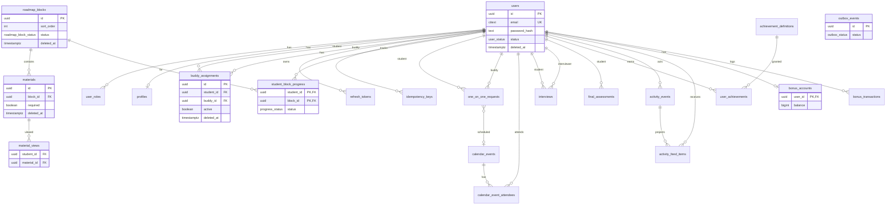

# PostgreSQL schema v1.0

Baseline relational model for the Go mentorship platform. Migrations live in `migrations/` (golang-migrate).

## ER model

## Migration files

| Version | File | Content |
|---------|------|---------|
| 000001 | `000001_init` | `pgcrypto`, `citext` |
| 000002 | `000002_enums` | PostgreSQL ENUM types |
| 000003 | `000003_identity_user_profile` | users, roles, buddy, profiles, refresh, idempotency |
| 000004 | `000004_roadmap_progress` | roadmap, materials, progress, views |
| 000005 | `000005_sessions_calendar` | 1:1, calendar, interviews, final check |
| 000006 | `000006_gamification_activity` | achievements, activity, bonus, outbox |

## Business rules enforced in the database

| Invariant | Mechanism |
|-----------|-----------|
| Unique email | `users_email_active_uidx` (partial, `deleted_at IS NULL`) |
| One active buddy per student | `buddy_assignments_one_active_per_student_uidx` |
| Unique block sort order | `roadmap_blocks_sort_order_active_uidx` |
| Unique material order in block | `materials_block_sort_order_active_uidx` |
| One view per student/material | `material_views_student_material_uidx` |
| Non-negative bonus balance | `bonus_accounts_balance_non_negative` |
| Idempotent bonus convert | `bonus_transactions_idempotency_key_uidx` |
| One achievement grant per user/code | PK `(user_id, achievement_code)` |
| Idempotent achievement grant | `user_achievements_source_event_uidx` |
| One open final assessment per student | `final_assessments_one_open_per_student_uidx` |
| Roast after passed tech (baseline) | `final_assessments_roast_after_tech` CHECK |
| Publish/draft consistency | `roadmap_blocks_published_consistency` |
| Calendar time range | `calendar_events_time_range` |
| Idempotent API keys | `idempotency_keys_user_scope_key_uidx` |

Rules still enforced primarily in **application** layer (state machines, buddy scope, required views before submit, calendar overlap): transactions, row locks, and explicit checks.

## Index catalog

See [INDEXES.md](./INDEXES.md) for the full list and rationale.

## Soft delete

| Table | Column | Reason |
|-------|--------|--------|
| `users` | `deleted_at` | Retain referential history; login blocked via `status` + partial unique email |
| `buddy_assignments` | `deleted_at` | Historical assignments |
| `roadmap_blocks` | `deleted_at` | Catalog history with existing progress |
| `materials` | `deleted_at` | Preserve `material_views` |
| `calendar_events` | `deleted_at` | Cancel without losing audit trail |
| `achievement_definitions` | `deleted_at` | Retire codes without breaking grants |

## ISO/IEC 25010 mapping

- **Performance Efficiency:** partial indexes for hot lists (published roadmap, unread feed, pending outbox); composite indexes for buddy/student dashboards; no redundant wide indexes on JSONB except feed filters.
- **Reliability:** FK constraints, CHECK constraints, unique partial indexes for idempotency and single-active records; `outbox_events` for at-least-once side effects; `bonus_accounts.balance` guarded by CHECK (reconciled in TX with transactions).
- **Maintainability:** ENUM types in one migration; bounded-context-aligned migration files; documented ER and index purposes.
